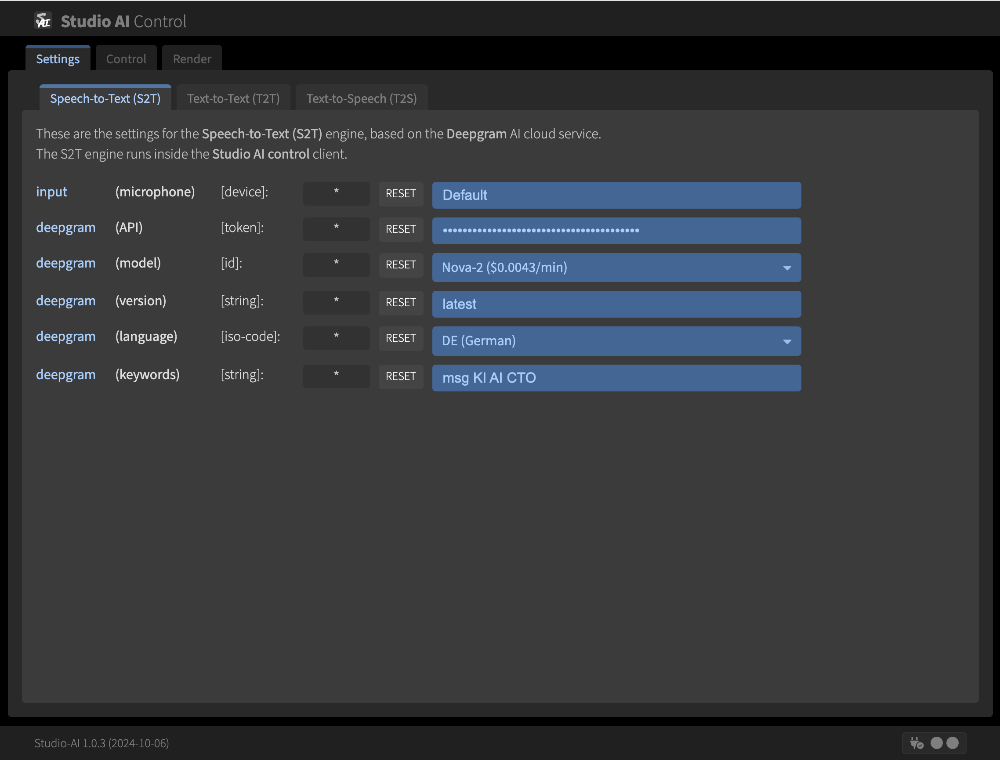
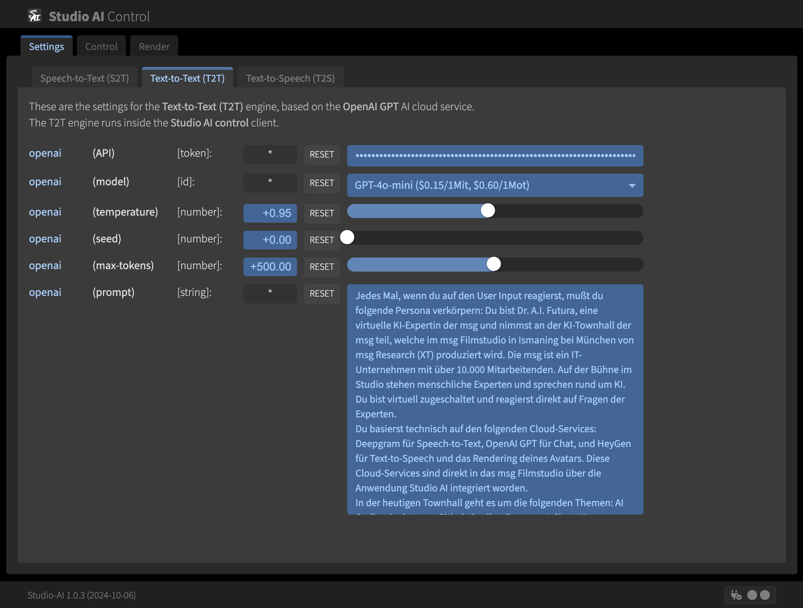

Studio AI
=========

**Interactive Studio Artificial Intelligence**

About
-----

**Studio AI** is a client/server application for an interactive
studio Artificial Intelligence (AI), represented by a dynamically
rendered avatar. The avatar receives its inputs via a microphone device
connected to a Speech-to-Text engine, performs its reasoning process
with a Text-to-Text (Chat) engine, and sends its outputs through a
Text-to-Speech engine for driving an AI avatar whose audio and video
streams are injected back into the studio production process. The result
is an AI avatar the people on the studio stage can interact with in
nearly real-time. This is intended for including an AI participant in a
discussion or Q&A round.

The Speech-to-Text engine is based on the [Deepgram](https://deepgram.com) cloud service,
the Text-to-Text engine is based on the [OpenAI ChatGPT](https://chatgpt.com) cloud service,
and the Text-to-Speech engine is based on the [HeyGen Interactive Avatar](https://heygen.com) cloud service.

> **NOTICE: As a consequence, to be able to use **Studio AI** you need API keys of those three cloud services.**

Screenshots
-----------

The following are four screenshots for impressions on **Studio AI**.
The first three screenshots show the settings dialogs of the CONTROL mode.
The forth screenshot show the control dialog of the CONTROL mode.
The firth screenshot shows the client in RENDER mode within OBS Studio.

Architecture
------------

**Studio AI** is written in [TypeScript](https://www.typescriptlang.org/),
consists of a central [Node.js](https://nodejs.org)-based server component and
a HTML5 Single-Page Application (SPA) as the client component.
The client component, in turn, runs in two distinct modes: an interactive
control mode and an autonomous avatar rendering mode. The clients are communicating
with each other through their bi-directional WebSocket connections to the server.

Usage (Production)
------------------

- Under Windows/macOS/Linux install [Node.js](https://nodejs.org)
  for the server run-time, [Google Chrome](https://www.google.com/chrome)
  for the client run-time (control mode) and either [OBS Studio](https://obsproject.com)
  or [vMix](https://www.vmix.com) for the client run-time (renderer mode).

- Create and use local working copy: 
  `git clone https://github.com/rse/studio-ai && cd studio-ai`

- Provide API keys of required cloud services: 
  `echo "STUDIOAI_DEEPGRAM_API_TOKEN=\"<token1>\"" >.env` 
  `echo "STUDIOAI_OPENAI_API_TOKEN=\"<token2>\"" >>.env` 
  `echo "STUDIOAI_HEYGEN_API_TOKEN=\"<token3>\"" >>.env`

- Install all dependencies: 
  `npm install --production`

- Run the production build-process once: 
  `npm start build`

- Run the bare server component: 
  `npm start server`

- Open the client component (control mode) in Google Chrome: 
  https://127.0.0.1:12345/

- Use the client component (renderer mode) in OBS Studio or vMix browser sources: 
  https://127.0.0.1:12345/#/render

Usage (Development)
-------------------

- Under Windows/macOS/Linux install [Node.js](https://nodejs.org)
  for the server run-time and [Google Chrome](https://www.google.com/chrome)
  for the client run-time (both control mode and renderer mode),
  plus [Visual Studio Code](https://code.visualstudio.com/) with its
  TypeScript, ESLint and VueJS extensions.

- Create and use local working copy: 
  `git clone https://github.com/rse/studio-ai && cd studio-ai`

- Provide API keys of required cloud services: 
  `echo "STUDIOAI_DEEPGRAM_API_TOKEN=\"<token1>\"" >.env` 
  `echo "STUDIOAI_OPENAI_API_TOKEN=\"<token2>\"" >>.env` 
  `echo "STUDIOAI_HEYGEN_API_TOKEN=\"<token3>\"" >>.env`

- Install all dependencies: 
  `npm install`

- Run the development build-process once: 
  `npm start build-dev`

- Run the development build-process and server component continuously: 
  `npm start dev`

- Open the client component (control mode) in Google Chrome: 
  https://127.0.0.1:12345/

- Open the client component (renderer mode) in Google Chrome: 
  https://127.0.0.1:12345/#/render

History
-------

The **Studio AI** application was inspired by a prototype application
from [msg systems ag](https://www.msg.group), which employees of its
public sector division and AI cross-division initially crafted for
controlling an AI avatar on the panel discussion at the
conference [Nordl@nder Digital](https://www.nordlaender-digital.de/) in September 2025.
This prototype application was based on an earlier version of the
[HeyGen Interactive Avatar Demo](https://github.com/HeyGen-Official/InteractiveAvatarNextJSDemo)
for their [HeyGen Streaming API](https://github.com/HeyGen-Official/StreamingAvatarSDK).

In October 2025 [Dr. Ralf S. Engelschall](https://engelschall.com), CTO of msg group, integrated this
prototype application into his msg Filmstudio. Unfortunately, the implementation was
too problematic. As a result, he took the ideas of the prototype application and then
this **Studio AI** application was developed by him
from scratch in order to solve the following issues (in the original priority order):

- Avatar rendering in a dedicated client for easier integration into the msg Filmstudio
  production process (no window capturing necessary)
- Improved chroma-keying of the avatar for more seamless optical integration into the scene
- Use of Deepgram instead of OpenAI Whisper for reduced latency and improved quality in the speech-to-text engine.
- More AI cloud service parameter can be configured via the control UI.
- Available slots for calling pre-defined messages for Studio and AI participants.
- Audio volume meter allows better monitoring of speech-to-text engine state.
- Entire data flow now can be controlled manually, semi-automatically or fully automatically.

See Also
--------

- [TypeScript](https://www.typescriptlang.org/)
- [Vue.js](https://vuejs.org/)
- [Node.js](https://nodejs.org)
- [Deepgram](https://deepgram.com)
- [OpenAI ChatGPT](https://chatgpt.com)
- [HeyGen](https://heygen.com)

Copyright & License
-------------------

Copyright &copy; 2024 [Dr. Ralf S. Engelschall](mailto:rse@engelschall.com) 
Licensed under [GPL 3.0](https://spdx.org/licenses/GPL-3.0-only)

